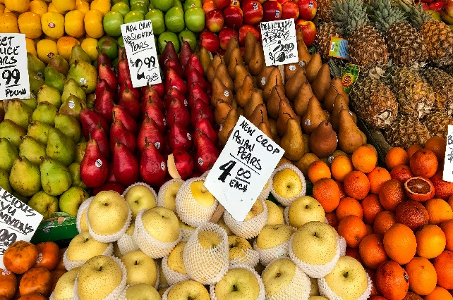

IPCA-15 sobe 0,39% em Junho e fica em 4,06% no acumulado dos últimos 12 meses

{fig-alt="Uso gratuito sob a Licença da Unsplash" fig-align="left" width="642" height="427"}

# Introdução

O início de uma análise estatística começa sempre pelo tipo de variável que estamos estudando. Para cada tipo existe uma técnica específica para aplicar.

```{r}
#| warning: false 
# Carregar pacotes
library(sidrar)
library(tidyverse)
library(echarts4r)
library(monochromeR)
```

```{r}
#| warning: false 
# Recuperando os dados via SIDRA
ipca_15 <- sidrar::get_sidra(
  x = 7062, # Tabela do IPCA-15
  variable = 355, # Variável: IPCA-15 Variação Mensal (%)
  period = c("last" = 24) # Período últimos 24 meses  
)

```

```{r}
# Tratamento dos dados

## Seleção das colunas
ipca_15 <- ipca_15 |>
  rename(valor = 'Valor',
         cod_mes = 'Mês (Código)',
         cod_abertura = 'Geral, grupo, subgrupo, item e subitem (Código)',
         desc_abertura = 'Geral, grupo, subgrupo, item e subitem') |> 
  select(valor, cod_mes, cod_abertura, desc_abertura)


## Separando a coluna desc_abertura
ipca_15 <- ipca_15 |> 
  tidyr::separate_wider_delim(
    cols = desc_abertura,
    delim = ".",
    names = c("cod", "desc"),
    too_few = "align_end",
    cols_remove = FALSE
  )

## Criando colunas
ipca_15 <- ipca_15 |>
  mutate(
    # Criando coluna data a partir da coluna cod_mes
    data = lubridate::dmy(paste0("01",
                                 stringr::str_sub(cod_mes, start = -2),
                                 stringr::str_sub(cod_mes, end = 4))),
    # Criando tipo para os níveis de abertura
    tipo_abertura = dplyr::case_when(
      nchar(cod) == 1 ~ "Grupo",
      nchar(cod) == 2 ~ "Subgrupo",
      nchar(cod) == 4 ~ "Item",
      nchar(cod) > 4 ~ "Subitem",
      is.na(cod) ~ "Geral"
    )
    )

```

```{r}
# Gráfico de evolução do IPCA-15
ipca_15 |> 
  filter(tipo_abertura == "Geral") |> 
  echarts4r::e_charts(x = data) |> 
  echarts4r::e_line(serie = valor,
                    name = "IPCA-15",
                    color = "darkblue",
                    smooth = FALSE) |> 
  echarts4r::e_tooltip(trigger = "axis",
                       borderColor = "darkblue",
                       backgroundColor = "rgba(255,255,255,0.9)") |> 
  echarts4r::e_title("Evolução do IPCA-15") |> 
  echarts4r::e_legend(show = FALSE) |> 
  echarts4r::e_axis_labels(y = "IPCA-15 mensal (%)")
```

```{r}
# Criando a paleta de cores
paleta <- RColorBrewer::brewer.pal(9, 
                                   name = "Spectral")
# Gráfico de colunas empilhadas
ipca_15 |> 
  filter(tipo_abertura == "Grupo") |>
  select(data, cod, valor) |> 
  pivot_wider(names_from = cod,
              values_from = valor) |> 
  e_charts(data) |> 
  e_bar(1, name = "1. Alimentação e bebidas", color = paleta[1], stack = "grp") |> 
  e_bar(2, name = "2. Habitação", color = paleta[2], stack = "grp") |> 
  e_bar(3, name = "3. Artigos de residência", color = paleta[3], stack = "grp") |> 
  e_bar(4, name = "4. Vestuário", color = paleta[4], stack = "grp") |>
  e_bar(5, name = "5. Transportes", color = paleta[5], stack = "grp") |>
  e_bar(6, name = "6. Saúde e cuidados pessoais", color = paleta[6], stack = "grp") |>
  e_bar(7, name = "7. Despesas pessoais", color = paleta[7], stack = "grp") |>
  e_bar(8, name = "8. Educação", color = paleta[8], stack = "grp") |>
  e_bar(9, name = "9. Comunicação", color = paleta[9], stack = "grp") |>
  e_tooltip(trigger = "axis", backgroundColor = "rgba(255,255,255,0.9)") |>
  e_legend(show = FALSE) |> 
  echarts4r::e_title("Impacto dos grupos de produto e serviçoes no IPCA-15") |> 
  echarts4r::e_axis_labels(y = "IPCA-15 mensal (%)")
  
  # highcharter::hchart("column",
  #                     hcaes(x = data,
  #                           y = valor,
  #                           group = desc_abertura),
  #                     name = ipca_grupos_nomes,
  #                     color = ipca_grupos_pal,
  #                     stacking = "normal") |>
  # highcharter::hc_title(text = "Impacto dos grupos de produto e serviçoes no IPCA-15",
  #                       align = "left") |> 
  # highcharter::hc_xAxis(title = list(text = "Data")) |> 
  # highcharter::hc_yAxis(title = list(text = "Variação Mensal (%)"))
```
